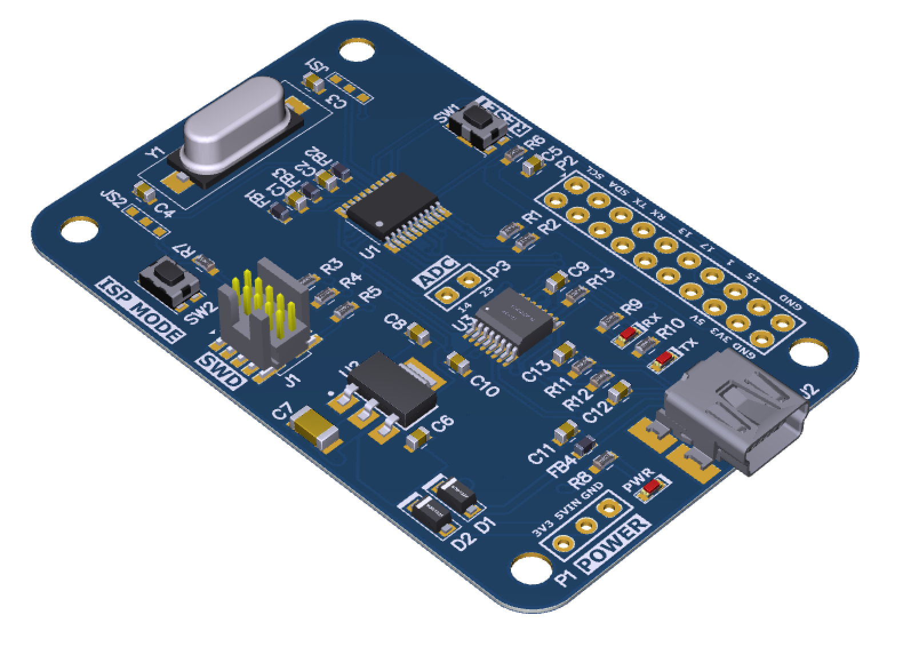
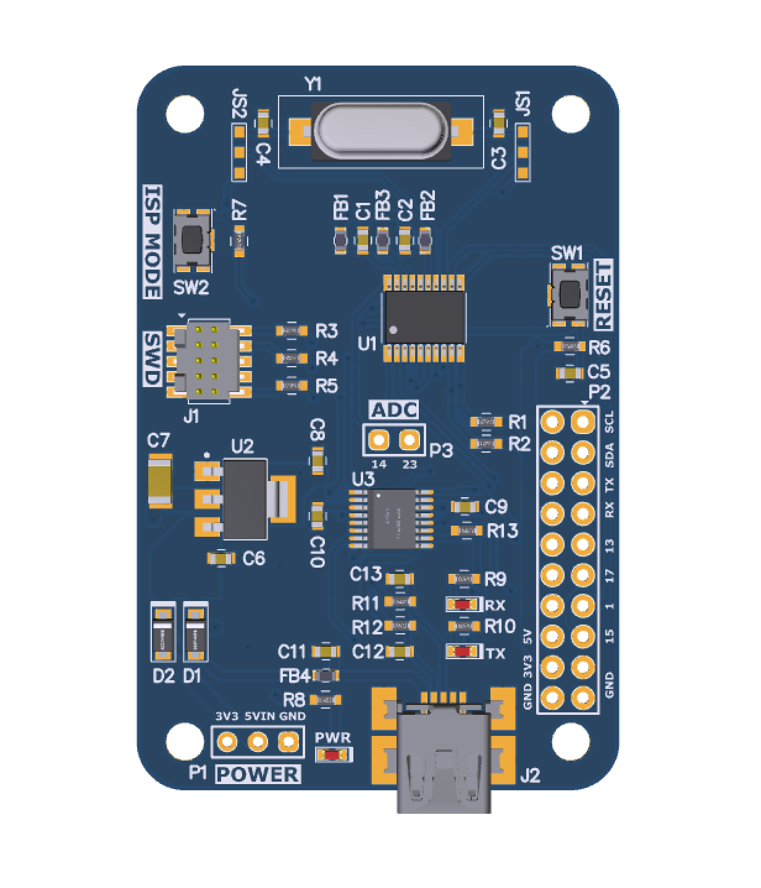
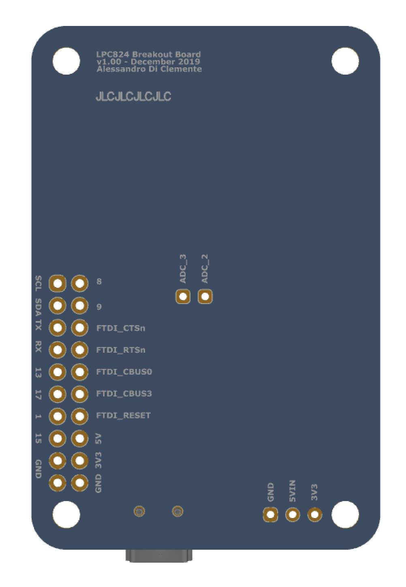

# LPC824 TSSOP-20 Breakout Board

Breakout Board for NXP LPC824 TSSOP-20 microcontroller with external oscillator and UART-to-USB bridge connection both for user application and ISP flash programming.

Predicted applications:

- Basic, general purpose prototyping
- Sensor logging and interfacing
- LPC82x series evaluation and MCUXpresso learning
- Motor control

## Project specifications
I designed this board for three reasons:

1. Have a **simple**, **low cost** and debug-enabled **32 bit** ARM microcontroller platform for simple general purpose applications which can be used instead of *common 8-bit solutions*.
2. Testing my soldering capabilities with cheap generic equipment (1.5 mm diameter iron tip).
3. Have fun with my first MCU custom board.

Then the main specifications for the project where:

1. Use NXP's **LPC800 series** microcontroller for low cost, basic functionality and ARM Cortex-M0+ core.
2. SMD components dimensions and footprint density must be within my assembly capabilities (minimum standard size **0603**).
3. No BGA or QFN packages for ICs.
4. Have a easy access to ISP programming and UART logging via **FTDI bridge**.

## Board features
The chosen microcontroller is the [**LPC824M201JDH20J**](https://www.nxp.com/products/processors-and-microcontrollers/arm-microcontrollers/general-purpose-mcus/lpc800-cortex-m0-plus-/low-cost-microcontrollers-mcus-based-on-arm-cortex-m0-plus-cores:LPC82X?tab=Buy_Parametric_Tab#/) which has a **20 pin package**. The designed board has the following main features:

- LDO voltage regulator with 3.3V/1A max output and power LED. Input voltage can be sourced from USB connector or external voltage `Vin` on **P1** connector in range 5-18V (on silkscreen it's named *5VIN*).
- **SWD** debug probe connector (**J1**) to interface the board to [MCUXpresso IDE](https://www.nxp.com/design/software/development-software/mcuxpresso-software-and-tools/mcuxpresso-integrated-development-environment-ide:MCUXpresso-IDE) for easy programming and debugging, using [LPCLink-2 probe](https://www.nxp.com/design/microcontrollers-developer-resources/lpc-microcontroller-utilities/lpc-link2:OM13054).
- **Reset** (**SW1**) and **ISP boot** (**SW2**) tactile buttons for easy access.
- **FTDI UART/USB bridge** with **Mini USB** connector (**J2**) for easy soldering.
- Easy access to all MCU and FTDI pins via header connector (**P2**) and dedicated ADC connector (**P3**) for low losses and noise.
- **External crystal oscillator** can be optionally used as system clock source. Solder joints (JS1 and JS2) enable to choice between XTAL or GPIO operations of MCU pins.
- **2-layers PCB** with components only on one layer, dimensions: **40x60 mm**; mounting holes.

## Versions

**LPC824_20_BB v1.0.0**

PCB manufactured by JLCPCB.
Fully tested except for RX and TX LEDs which I didn't solder on my test board. In future versions, I may consider to add a user LED; additional vias may be added below the LDO to enhance heat dissipation in case of higher voltage inputs.

**Please contact me if you are interested in schematics or gerber files.**

